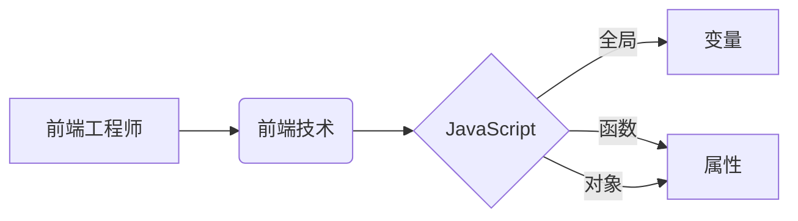
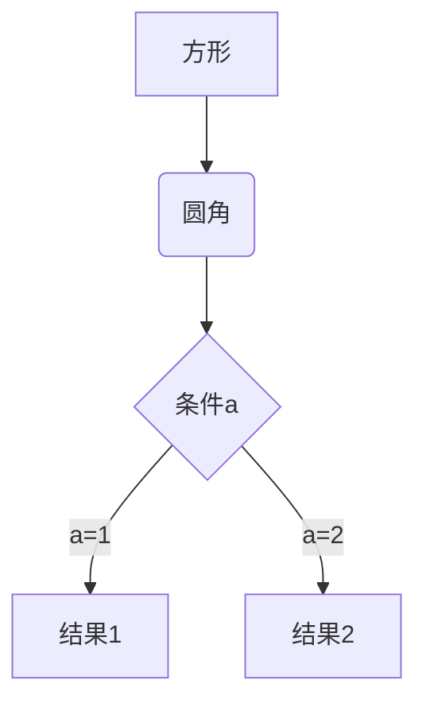
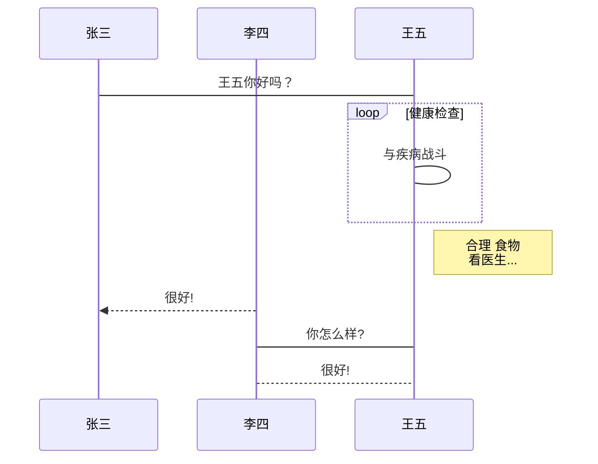

<!--
 * @LastEditTime: 2021-04-19 11:08:11
 * @LastEditors: jinxiaojian
-->
# mark复杂语法学习

表格

- 实验

| 左对齐 | 右对齐 | 居中对齐 |
| :-----| ----: | :----: |
| 单元格12313 | 单元格123123123 | 单元格213421342 |
| 单元格 | 单元格 | 单元格 |

- 实验

|表|格|
|:-----|:-----|
|1|2|


- 实验

|jxj|web|.|top|
|:-----|:-----|:-----|:-----|
|1||||
||2|||
|||3||
||||4|


1、横向流程图源码格式：


2、竖向流程图源码格式：

3、标准流程图源码格式：

```flow
st=>start: 开始框
op=>operation: 处理框
cond=>condition: 判断框(是或否?)
sub1=>subroutine: 子流程
io=>inputoutput: 输入输出框
e=>end: 结束框
st->op->cond
cond(yes)->io->e
cond(no)->sub1(right)->op
```
4、标准流程图源码格式（横向）：

```flow
st=>start: 开始框
op=>operation: 处理框
cond=>condition: 判断框(是或否?)
sub1=>subroutine: 子流程
io=>inputoutput: 输入输出框
e=>end: 结束框
st(right)->op(right)->cond
cond(yes)->io(bottom)->e
cond(no)->sub1(right)->op
```
5、UML时序图源码样例：

```sequence
对象A->对象B: 对象B你好吗?（请求）
Note right of 对象B: 对象B的描述
Note left of 对象A: 对象A的描述(提示)
对象B-->对象A: 我很好(响应)
对象A->对象B: 你真的好吗？
```
6、UML时序图源码复杂样例：

```sequence
Title: 标题：复杂使用
对象A->对象B: 对象B你好吗?（请求）
Note right of 对象B: 对象B的描述
Note left of 对象A: 对象A的描述(提示)
对象B-->对象A: 我很好(响应)
对象B->小三: 你好吗
小三-->>对象A: 对象B找我了
对象A->对象B: 你真的好吗？
Note over 小三,对象B: 我们是朋友
participant C
Note right of C: 没人陪我玩
```
7、UML标准时序图样例：

