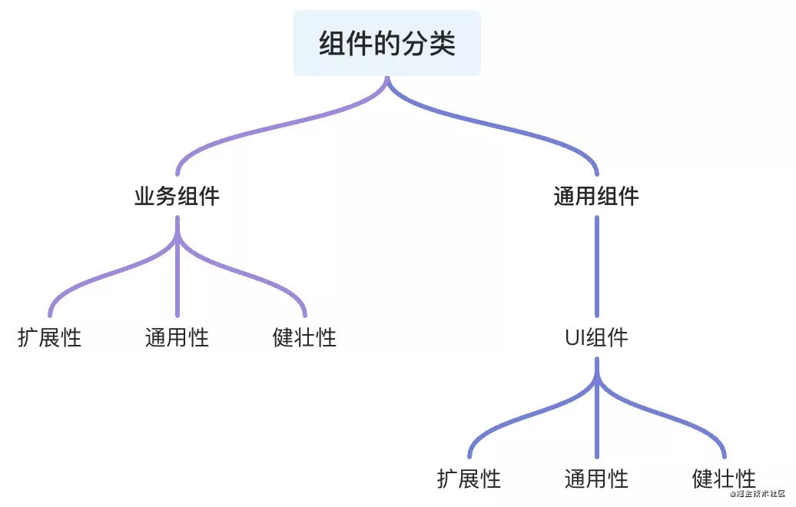
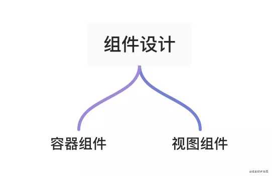

<!--
 * @LastEditTime: 2021-10-18 23:58:31
 * @LastEditors: jinxiaojian
-->
# 组件知识
# 组件是页面不可或缺的部分，优秀的组件设计可以提高工作的效率

## 组件是如何分类的
## 怎样才是一个好的组件

## 组件是如何分类的

- 业务组件
- 通用组件

无论是 业务组件 或者 通用组件都具备组件本质所包含的三个性质
- 扩展
- 通用
- 健壮

扩展性：在原有组件基础上可 二次封装 扩展成新的组件符合设计的开闭原则

通用性：根据组件接受的参数和组件中与业务的解耦比来衡量组件的通用性,并不是通用性占比100%的组件就是最好的组件，需要根据 不同的场景 分析

健壮性：避免组件中参数处理和函数执行过程可能出现的奔溃和错误导致程序的直接挂断，单测以对组件内部 做好边界处理，异常错误的捕获来衡量这一标准

### 封装组件的时候需要考虑过一些问题

组件的可维护性?
组件的可读性?
扩展性、健壮性、通用性?
这个组件是否需要封装抽离?
组件是否和业务强关联？

`React 推荐 一个组件代码长度在 200 - 500 行最佳`

## 业务组件

容器组件负责处理业务相关逻辑,注册业务相关钩子,传入相应的熟悉和插槽等
视图组件则负责数据的呈现,交互的实现

容器组件往往不可复用

视图组件则根据组件的样式 和 交互 判断组件在项目中的 频率 来抉择是否封装

视图 和 数据 解耦 又能搭配 可以很好的提升组件的 可读,易维护性

通常情况，组件中的大量数据来源 当前组件的接口请求。没有依赖或者几乎不依赖外部传入的props等，称为业务强关联组件，放弃组件封装的想法。

## 通用组件

直接脱离 UI
接受参数，处理钩子
Ant design 则是对API 和 UI 的二次封装, 进而体现了 React Components 的组件的 可扩展性

封装设计组件UI的最佳方式

零业务代码
优秀的UI和API设计
易学和易用

组件中的 UI 和 数据 业务尽量 分离
UI视图 组件中 不该包含 业务代码
组件设计之初考虑通用、易用、扩展、健壮稳定 以及 良好的代码结构、Api设计使用